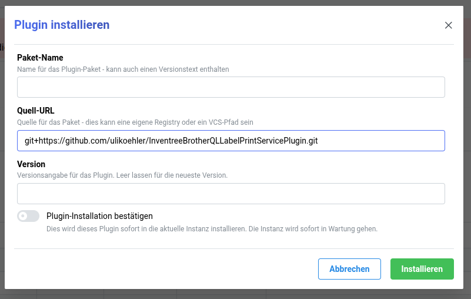

# Remote HTTP print service

An [InvenTree](https://inventree.org) label-printing plugin that sends
rendered labels to a running
[BrotherQL Label Print Service](https://github.com/ulikoehler/BrotherQLLabelPrintService)
over HTTP.

The BrotherQL service is a small FastAPI app that wraps
[`brother_ql_next`](https://github.com/adamRehn/brother_ql_next) and drives a
local Brother QL label printer (QL-500/550/560/570/580N/600/650TD/700/710W/
720NW/800/810W/820NWB/1050/1060N/1100/1100NWB/1110NWB/1115NWB) over USB or
network. Running it on a Raspberry Pi (or similar) next to the printer means
InvenTree only needs to speak HTTP — no USB drivers, no `brother_ql` install
on the InvenTree host.

## How it works

1. You trigger a label print in InvenTree (e.g. from a StockItem page).
2. InvenTree renders the label template to PDF, then to a 300 DPI PNG.
3. This plugin uploads that PNG to the BrotherQL service via
   `POST /api/upload` (multipart).
4. The plugin queues the upload for printing via `POST /api/print`.
5. If **Wait for print completion** is enabled (default), the plugin polls
   `GET /api/queue` until the job reaches `printed` or `failed` and surfaces
   failures as InvenTree `ValidationError`s.

## Installation

### From the command line

```bash
# From your InvenTree venv:
pip install git+https://github.com/ulikoehler/InventreeBrotherQLLabelPrintServicePlugin.git
# (or, for local development:)
pip install --editable /path/to/InventreeBrotherQLLabelPrintServicePlugin
```

### From the InvenTree web UI

Go to **Admin UI → Settings → Plugin Settings → Install Plugin** and enter:

- **Package Name**: `inventree-remote-http-print-service`
- **Source URL**: `git+https://github.com/ulikoehler/InventreeBrotherQLLabelPrintServicePlugin.git`

> **Important:** The Source URL **must** start with `git+https://`. Without the
> `git+` prefix, InvenTree treats the URL as a custom PyPI index (pip's `-i`
> flag) instead of a VCS install source, and pip fails with
> *"You must give at least one requirement to install"*.

> **The Package Name must match the `name` field in the package's
> `pyproject.toml` exactly** (here: `inventree-remote-http-print-service`). Do **not**
> use the GitHub repository name — pip will reject it with *"inconsistent
> name"* / *"No matching distribution found"*. Do **not** leave Package Name
> empty either — InvenTree needs it to look up the installed package, save it
> to `plugins.txt`, and reload the plugin registry. Without it, the package is
> pip-installed but never appears in the plugin list.



### Enabling the plugin

Then restart InvenTree and enable the plugin:

- **Admin UI → Settings → Plugin Settings → Remote HTTP print service → enabled**
- Or set `remote-http-print.enabled = True` in your `config.yaml` and run
  `invoke update` (or restart the worker).

## Configuration

All settings live under **Admin UI → Settings → Plugin Settings → Remote HTTP print service**.

| Setting | Default | Description |
|---|---|---|
| `ENDPOINTS` | `[]` *(required)* | JSON list of print endpoints. Each entry is `{"name": "...", "url": "..."}`, e.g. `[{"name": "Office", "url": "http://10.0.0.42:8080"}, {"name": "Warehouse", "url": "http://10.0.0.99:8080"}]` |
| `DEFAULT_ENDPOINT` | *(empty)* | Name of the endpoint to use when none is selected in the print dialog. Leave blank to use the first endpoint. |
| `REQUEST_TIMEOUT` | `30` | Per-HTTP-request timeout in seconds |
| `VERIFY_SSL` | `True` | Disable only for trusted internal services with self-signed certs |
| `DEFAULT_LABEL` | *(empty)* | `brother_ql` label identifier used when the print dialog doesn't override it. Examples: `62` (endless 62mm tape), `62x29` (die-cut), `d24` (round 24mm) |
| `DEFAULT_COPIES` | `1` | Default number of copies |
| `POLL_STATUS` | `True` | Wait for each job to reach `printed`/`failed` before returning |
| `POLL_INTERVAL` | `2` | Seconds between queue status polls |
| `POLL_TIMEOUT` | `60` | Max seconds to wait per job before returning (job may still complete later) |
| `AUTO_CUT` | `True` | Cut the tape after each label |
| `DITHER` | `False` | Floyd–Steinberg dithering (overrides `THRESHOLD`) |
| `THRESHOLD` | `70` | B/W cutoff percentage (0–100) |
| `HQ` | `True` | High-quality mode (slower) |
| `SYNC_SERVER_SETTINGS` | `True` | Push `AUTO_CUT`/`DITHER`/`THRESHOLD`/`HQ` to the service via `PUT /api/settings` at the start of every print batch |

> **Note on cut/dither/threshold/HQ:** the BrotherQL service only stores these
> in its own `config.yaml` (mutated via `PUT /api/settings`), not per request.
> The plugin syncs them once per print batch in `before_printing`. If you
> manage `config.yaml` by hand on the service host, set
> `SYNC_SERVER_SETTINGS = False` to prevent the plugin from overriding your
> values.

## Per-print options

When you select **Remote HTTP print service** in the InvenTree print
dialog, the following extra fields appear:

- **Endpoint** — select which print endpoint to use (leave blank for the default endpoint)
- **Copies** — overrides `DEFAULT_COPIES`
- **Label type** — overrides `DEFAULT_LABEL` (e.g. `62`, `62x29`, `d24`)
- **Orientation** — `Auto` (recommended), `Portrait`, or `Landscape`
- **Resize to tape width** — force-resize if dimensions don't match the tape
  (auto-enabled when you force an orientation that disagrees with the image)
- **Wait for print completion** — overrides `POLL_STATUS` for this job

## Label-size caveats

The BrotherQL service **rejects** images whose shorter edge doesn't match the
configured tape width (HTTP 422) unless you pass `orientation` and
`resize: true`. To avoid surprises:

- For endless tape, set the InvenTree label template width to match the tape
  (e.g. 62mm → 696px at 300 DPI). The plugin will then pass the PNG through
  unchanged.
- For die-cut labels, the server still requires one edge to match the tape
  width — keep the template width equal to the tape width even if the label
  itself is shorter.
- If you must print an off-size label, enable **Resize to tape width** in the
  print dialog; the server will LANCZOS-resize before rasterising.

## Server-side discovery (optional)

The BrotherQL service exposes a few helpful read-only endpoints you can hit
directly while configuring the plugin:

```bash
# What label types does brother_ql_next know about?
curl http://localhost:8080/api/labels | jq

# Which printer models are supported?
curl http://localhost:8080/api/models

# Is the printer connected & ready?
curl http://localhost:8080/api/printer/status

# Recent print history (job statuses)
curl http://localhost:8080/api/queue | jq
```

## Development

```bash
pip install --editable ".[test]"
pytest -q
```

Tests use the [`responses`](https://github.com/getsentry/responses) library to
mock the BrotherQL HTTP API, so they run without a real printer or service.

## License

MIT — see [LICENSE](LICENSE). The BrotherQL Label Print Service itself is
GPL-3.0; this plugin only talks to it over HTTP and includes none of its
source.
